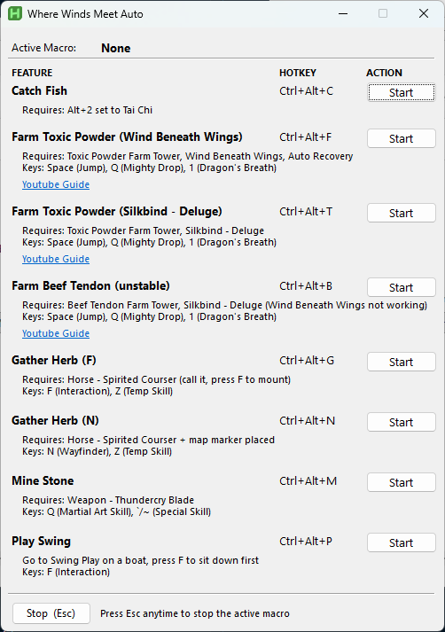
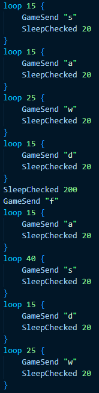
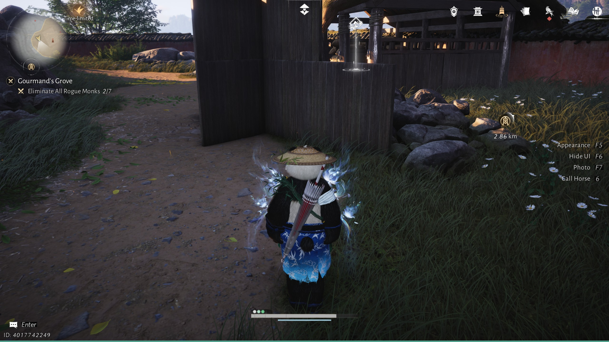

# Where Winds Meet Auto

AutoHotkey v2 automation script for _Where Winds Meet_ with a GUI launcher and hotkeys for fishing, herb gathering, mining, farming, and mini-games.

---

## Features

| Macro                                  | Hotkey     | Requires                                                   |
| -------------------------------------- | ---------- | ---------------------------------------------------------- |
| Catch Fish                             | Ctrl+Alt+C | Alt+2 set to Tai Chi                                       |
| Farm Toxic Powder (Wind Beneath Wings) | Ctrl+Alt+F | Toxic Powder Farm Tower, Wind Beneath Wings, Auto Recovery |
| Farm Toxic Powder (Silkbind - Deluge)  | Ctrl+Alt+T | Toxic Powder Farm Tower, Silkbind - Deluge                 |
| Farm Beef Tendon (unstable)            | Ctrl+Alt+B | Beef Tendon Farm Tower, Silkbind - Deluge                  |
| Gather Herb (F)                        | Ctrl+Alt+G | Horse — Spirited Courser (call it, press F to mount)       |
| Gather Herb (N)                        | Ctrl+Alt+N | Horse — Spirited Courser + map marker placed               |
| Mine Stone                             | Ctrl+Alt+M | Weapon — Thundercry Blade                                  |
| Play Swing                             | Ctrl+Alt+P | Sit on a boat swing first                                  |

---

## Download & Setup

**Option A — Standalone executable (recommended)**

1. Download `WhereWindsMeetAuto.exe` from [Releases](../../releases/latest).
2. Right-click `WhereWindsMeetAuto.exe` → **Run as administrator**.

**Option B — Run the script directly**

1. Install [AutoHotkey v2](https://www.autohotkey.com/).
2. Right-click `WhereWindsMeetAuto.ahk` → **Run as administrator**.

---

## Usage Notes

- **Administrator required** — Both the `.exe` and `.ahk` must be run as administrator.
- **Auto-focus** — Clicking **Start** will automatically bring the game window into focus.
- **One macro at a time** — Only one macro can run at a time. Press **Esc** to stop the active macro before starting a new one.

---

## Macro Recorder

[Macro Recorder](https://www.macrorecorder.com/) scripts are included in [MacroRecorder](/MacroRecorder/) if you want to update skill/interactive keys without programming knowledge.

---

## Farm Beef Tendon (unstable)

The respawn point of the enemy often changes between sessions, so this macro may need adjustments each time.

- It is highly recommended to make your own changes and run the script directly.
- Update the number of repetitions to control how your character collects items.

**AutoHotkey**

**Macro Recorder**

**Tower setup** — Build it like this to prevent the character from going outside the tower:

---

## Disclaimer

This tool automates keyboard inputs for _Where Winds Meet_. Use it at your own risk. Automation may violate the game's Terms of Service and could result in account penalties. The author is not responsible for any consequences arising from its use.

---

## License

MIT — see [LICENSE](LICENSE).
