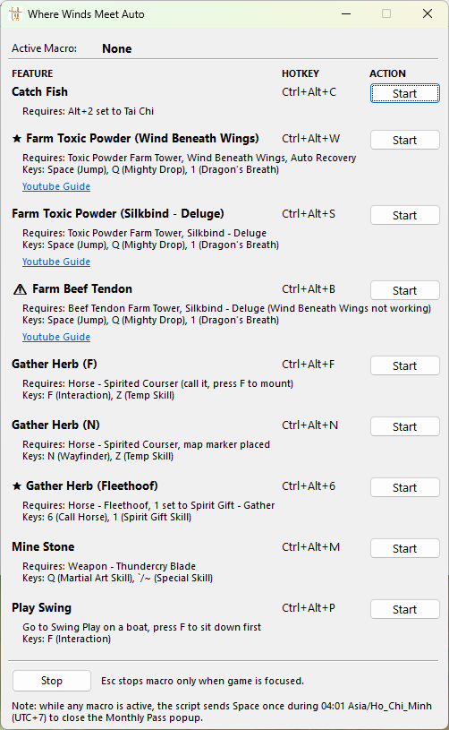
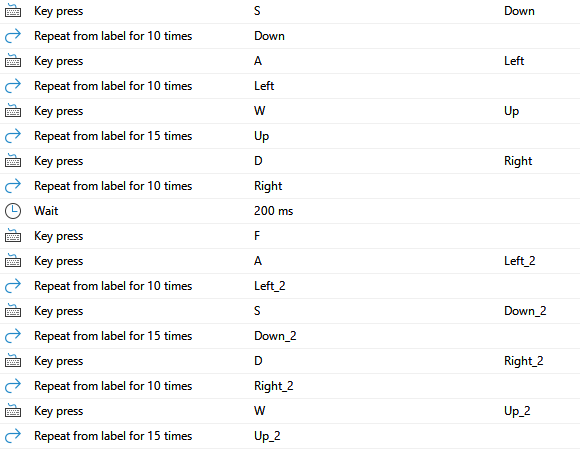

# Where Winds Meet Auto

AutoHotkey v2 automation script for _Where Winds Meet_ with a GUI launcher and hotkeys for fishing, herb gathering, mining, farming, and mini-games.

---

## Features

| Macro                                     | Hotkey     | Requires                                                   |
| ----------------------------------------- | ---------- | ---------------------------------------------------------- |
| Catch Fish                                | Ctrl+Alt+C | Alt+2 set to Tai Chi                                       |
| ⭐ Farm Toxic Powder (Wind Beneath Wings) | Ctrl+Alt+W | Toxic Powder Farm Tower, Wind Beneath Wings, Auto Recovery |
| Farm Toxic Powder (Silkbind - Deluge)     | Ctrl+Alt+S | Toxic Powder Farm Tower, Silkbind - Deluge                 |
| ⚠️ Farm Beef Tendon                       | Ctrl+Alt+B | Beef Tendon Farm Tower, Silkbind - Deluge                  |
| Gather Herb (F)                           | Ctrl+Alt+F | Horse — Spirited Courser (call it, press F to mount)       |
| Gather Herb (N)                           | Ctrl+Alt+N | Horse — Spirited Courser, map marker placed                |
| ⭐ Gather Herb (Fleethoof)                | Ctrl+Alt+6 | Horse — Fleethoof, 1 set to Spirit Gift - Gather           |
| Mine Stone                                | Ctrl+Alt+M | Weapon — Thundercry Blade                                  |
| Play Swing                                | Ctrl+Alt+P | Sit on a boat swing first                                  |

---

## Download & Setup

**Option A — Standalone executable (recommended)**

1. Download `WhereWindsMeetAuto.exe` from [Releases](../../releases/latest).
2. Right-click `WhereWindsMeetAuto.exe` → **Run as administrator**.

**Option B — Run the script directly**

1. Install [AutoHotkey v2](https://www.autohotkey.com/).
2. Right-click `WhereWindsMeetAuto.ahk` → **Run as administrator**.

---

## Usage Notes

- **Administrator required** — Both the `.exe` and `.ahk` must be run as administrator.
- **Auto-focus** — Clicking **Start** will automatically bring the game window into focus.
- **One macro at a time** — Only one macro can run at a time. Press **Esc** to stop the active macro before starting a new one.
- **Monthly Pass popup auto-dismiss** — While any macro is active, the script sends `Space` once during `04:01 Asia/Ho_Chi_Minh (UTC+7)` to close the Monthly Pass popup.

---

## Macro Recorder

[Macro Recorder](https://www.macrorecorder.com/) scripts are included in [MacroRecorder](/MacroRecorder/) if you want to update skill/interactive keys without programming knowledge.

---

## ⚠️ Farm Beef Tendon

> ⚠️ Enemy respawn position changes between sessions, so movement timings
> usually need tweaking after each login.

### AutoHotkey

The macro walks the character along a fixed path to collect drops using
`GameHold(key, ms)` (hold a movement key for a set duration, then release).

Edit the `GameHold` durations under the `; --- walk to drops ---` and `; --- reposition for next loop ---` comments in `RunBeefTendon()` to match your current tower layout. Increase the value if the character falls short; decrease if it overshoots.

### Macro Recorder (not recommended)

Since **Where Winds Meet v1.7**, rapid successive key taps no longer move
the character reliably. Macro Recorder scripts using repeated keypress
loops are therefore broken or imprecise:

| Loop type                         | Result      | Reason                                                                       |
| --------------------------------- | ----------- | ---------------------------------------------------------------------------- |
| `Repeat from label for X times`   | ❌ Broken   | Rapid taps make the character move erratically                               |
| `Repeat from label for X seconds` | ⚠️ Unusable | Timer only accepts whole seconds; movement here needs ~100–2000 ms precision |

You may still experiment with Macro Recorder if you prefer a visual
workflow, but for reliable movement timing AutoHotkey is strongly
recommended. See the image below for where to update your key timings/repetitions.

### Tower Layout

Build the tower like below so the character cannot walk outside:

---

## Disclaimer

This tool automates keyboard inputs for _Where Winds Meet_. Use it at your own risk. Automation may violate the game's Terms of Service and could result in account penalties. The author is not responsible for any consequences arising from its use.

---

## License

MIT — see [LICENSE](LICENSE).
